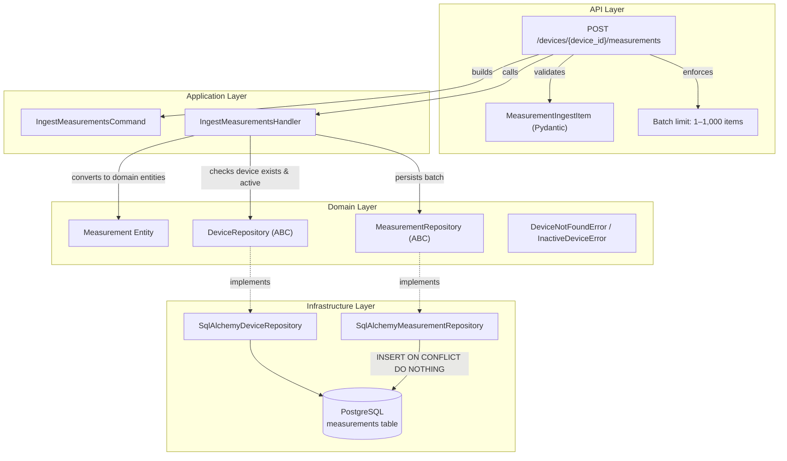

# Ingest Measurements Endpoint

## Goal

Add a new `POST /devices/{device_id}/measurements` endpoint that accepts a **batch** of measurements from an IoT device and persists them idempotently. The client provides a `measurement_id` (UUID) for each measurement, and the server uses it as the primary key to deduplicate on network retries.

## Business Rules

1. **Device must exist** → 404 if not found.
2. **Device must be active** (`is_active = true`) → 422 if inactive.
3. **Idempotent ingestion** → duplicate `measurement_id` values are silently skipped; always returns 201.
4. **Batch support** → the request body is an array of measurement objects.
5. **Batch size limit** → minimum 1, maximum 1,000 items per request. Larger payloads must be chunked by the client. Enforced at the Pydantic/HTTP layer (422 if violated).

---

## Proposed Changes

### Domain Layer

#### [MODIFY] `app/domain/exceptions.py` — add `InactiveDeviceError`

A new domain exception for attempts to ingest measurements on an inactive device.

```python
class InactiveDeviceError(DomainError):
    """Raised when an operation requires an active device but the device is inactive."""
```

> [!NOTE]
> `DeviceNotFoundError` already exists and will be reused.

---

#### [MODIFY] `app/domain/repositories.py` — extend `MeasurementRepository`

Add a `save_batch` method that accepts a list of `Measurement` entities and returns the count of **newly inserted** measurements (skipping duplicates).

```python
class MeasurementRepository(ABC):
    """Abstract repository interface for Measurement persistence operations."""

    @abstractmethod
    async def save(self, measurement: Measurement) -> None:
        """Persist a new Measurement."""
        ...

    @abstractmethod
    async def save_batch(self, measurements: list[Measurement]) -> int:
        """Persist a batch of measurements, skipping duplicates by id.
        
        Returns the number of newly inserted measurements.
        """
        ...
```

---

### Application Layer

#### [NEW] `app/application/measurement/__init__.py`

Package marker + re-exports.

#### [NEW] `app/application/measurement/ingest_measurements.py`

Command DTO and handler following the existing pattern from `update_device_activation.py`:

```python
from __future__ import annotations

from dataclasses import dataclass
from datetime import datetime
from uuid import UUID

from app.domain.exceptions import DeviceNotFoundError, InactiveDeviceError
from app.domain.repositories import DeviceRepository, MeasurementRepository
from app.domain.measurement import Measurement
from app.domain.value_objects import (
    DeviceId,
    MeasurementId,
    MeasurementType,
    MeasurementUnit,
    MeasurementValue,
    Timestamp,
)


@dataclass(frozen=True)
class MeasurementItem:
    """A single measurement within the ingestion command."""

    measurement_id: UUID
    type: str
    value: float
    unit: str
    timestamp: datetime


@dataclass(frozen=True)
class IngestMeasurementsCommand:
    """Command DTO for ingesting a batch of measurements for a device."""

    device_id: UUID
    measurements: list[MeasurementItem]


@dataclass
class IngestMeasurementsHandler:
    """Application handler for the IngestMeasurementsCommand use case."""

    device_repository: DeviceRepository
    measurement_repository: MeasurementRepository

    async def handle(self, command: IngestMeasurementsCommand) -> int:
        """
        Ingest a batch of measurements for the given device.

        Raises:
            DeviceNotFoundError: if the device does not exist.
            InactiveDeviceError: if the device is not active.

        Returns:
            The number of newly persisted measurements.
        """
        device = await self.device_repository.get_by_id(command.device_id)
        if device is None:
            raise DeviceNotFoundError(
                f"Device with id {command.device_id!r} not found."
            )

        if not device.is_active:
            raise InactiveDeviceError(
                f"Device {command.device_id!r} is inactive. "
                "Measurements cannot be ingested for inactive devices."
            )

        domain_measurements = [
            Measurement(
                id=MeasurementId(item.measurement_id),
                device_id=DeviceId(command.device_id),
                type=MeasurementType(item.type),
                value=MeasurementValue(item.value),
                unit=MeasurementUnit(item.unit),
                timestamp=Timestamp(item.timestamp),
            )
            for item in command.measurements
        ]

        return await self.measurement_repository.save_batch(domain_measurements)
```

> [!NOTE]
> The handler converts primitives → Value Objects in the application layer (as required by AGENTS.md). The domain `Measurement` entity receives only Value Objects.

---

### Infrastructure Layer

#### [NEW] `app/infrastructure/db/repositories/measurement_repository.py`

```python
from __future__ import annotations

from uuid import UUID

from sqlalchemy import select
from sqlalchemy.dialects.postgresql import insert as pg_insert
from sqlalchemy.ext.asyncio import AsyncSession

from app.domain.measurement import Measurement
from app.domain.repositories import MeasurementRepository
from app.domain.value_objects import (
    DeviceId,
    MeasurementId,
    MeasurementType,
    MeasurementUnit,
    MeasurementValue,
    Timestamp,
)
from app.infrastructure.db.models.measurement import MeasurementModel


class SqlAlchemyMeasurementRepository(MeasurementRepository):
    """SQLAlchemy implementation of the MeasurementRepository interface."""

    def __init__(self, session: AsyncSession) -> None:
        self._session = session

    async def save(self, measurement: Measurement) -> None:
        """Persist a single Measurement."""
        row = MeasurementModel(
            id=measurement.id.value,
            device_id=measurement.device_id.value,
            type=measurement.type.value,
            value=measurement.value.value,
            unit=measurement.unit.value,
            timestamp=measurement.timestamp.value,
        )
        self._session.add(row)
        await self._session.flush()

    async def save_batch(self, measurements: list[Measurement]) -> int:
        """Persist a batch of measurements, skipping duplicates by id.

        Uses PostgreSQL INSERT ... ON CONFLICT (id) DO NOTHING for
        atomic, idempotent upsert behaviour.

        Returns the number of newly inserted measurements.
        """
        if not measurements:
            return 0

        values = [
            {
                "id": m.id.value,
                "device_id": m.device_id.value,
                "type": m.type.value,
                "value": m.value.value,
                "unit": m.unit.value,
                "timestamp": m.timestamp.value,
            }
            for m in measurements
        ]

        stmt = pg_insert(MeasurementModel).values(values)
        stmt = stmt.on_conflict_do_nothing(index_elements=["id"])
        result = await self._session.execute(stmt)
        await self._session.flush()
        return result.rowcount
```

> [!IMPORTANT]
> **Idempotency strategy**: We use PostgreSQL's `INSERT ... ON CONFLICT (id) DO NOTHING`. Since the `measurements.id` column is the primary key (UUID provided by the client), duplicate measurement IDs are silently ignored at the database level. No extra round-trip or pre-check needed.

#### [MODIFY] `app/infrastructure/db/repositories/__init__.py`

Add the new repository to the exports:

```python
from app.infrastructure.db.repositories.device_repository import SqlAlchemyDeviceRepository
from app.infrastructure.db.repositories.measurement_repository import SqlAlchemyMeasurementRepository

__all__ = ["SqlAlchemyDeviceRepository", "SqlAlchemyMeasurementRepository"]
```

---

### API / Schema Layer

#### [NEW] `app/schemas/measurement.py`

Pydantic request schema for the ingestion payload:

```python
from __future__ import annotations

from datetime import datetime
from uuid import UUID

from pydantic import BaseModel, Field


class MeasurementIngestItem(BaseModel):
    """Schema for a single measurement within an ingestion request."""

    measurement_id: UUID = Field(description="Client-generated unique ID for idempotency")
    type: str = Field(min_length=1, max_length=100, description="Measurement type (e.g. 'temperature')")
    value: float = Field(description="Numeric measurement value")
    unit: str = Field(min_length=1, max_length=50, description="Unit of measurement (e.g. '°C')")
    timestamp: datetime = Field(description="UTC timestamp of the measurement")
```

#### [MODIFY] `app/api/dependencies.py`

Add DI wiring for `MeasurementRepository` and `IngestMeasurementsHandler`:

```python
# --- existing code stays ---

from app.application.measurement.ingest_measurements import IngestMeasurementsHandler
from app.domain.repositories import DeviceRepository, MeasurementRepository
from app.infrastructure.db.repositories.measurement_repository import SqlAlchemyMeasurementRepository


def get_measurement_repository(db: DbSessionDep) -> MeasurementRepository:
    """Dependency provider returning a concrete MeasurementRepository implementation."""
    return SqlAlchemyMeasurementRepository(db)


MeasurementRepositoryDep = Annotated[MeasurementRepository, Depends(get_measurement_repository)]


def get_ingest_measurements_handler(
    device_repository: DeviceRepositoryDep,
    measurement_repository: MeasurementRepositoryDep,
) -> IngestMeasurementsHandler:
    """Dependency provider returning the IngestMeasurementsHandler use case."""
    return IngestMeasurementsHandler(
        device_repository=device_repository,
        measurement_repository=measurement_repository,
    )


IngestMeasurementsHandlerDep = Annotated[
    IngestMeasurementsHandler,
    Depends(get_ingest_measurements_handler),
]
```

#### [MODIFY] `app/api/devices.py`

Add the new endpoint to the existing router. The batch size is enforced at the HTTP layer via `Annotated[list[...], Field(min_length=1, max_length=1000)]`:

```python
from typing import Annotated

from pydantic import Field

from app.api.dependencies import (
    IngestMeasurementsHandlerDep,
    UpdateDeviceActivationHandlerDep,
)
from app.application.measurement.ingest_measurements import (
    IngestMeasurementsCommand,
    MeasurementItem,
)
from app.domain.exceptions import DeviceNotFoundError, InactiveDeviceError
from app.schemas.measurement import MeasurementIngestItem


@router.post(
    "/{device_id}/measurements",
    status_code=status.HTTP_201_CREATED,
    summary="Ingest device measurements",
)
async def ingest_measurements(
    device_id: UUID,
    payload: Annotated[list[MeasurementIngestItem], Field(min_length=1, max_length=1000)],
    db: DbSessionDep,
    handler: IngestMeasurementsHandlerDep,
) -> None:
    """
    Ingest a batch of measurements for a device.

    - The client provides a unique `measurement_id` per measurement for idempotency.
    - Duplicate `measurement_id` values are silently ignored (no duplicates created).
    - Accepts between 1 and 1,000 measurements per request. Larger payloads must be chunked.
    - Returns **201 Created** on success (even for fully duplicate batches).
    - Returns **404** if the device does not exist.
    - Returns **422** if the device is inactive or payload validation fails.
    """
    async with db.begin():
        try:
            await handler.handle(
                IngestMeasurementsCommand(
                    device_id=device_id,
                    measurements=[
                        MeasurementItem(
                            measurement_id=item.measurement_id,
                            type=item.type,
                            value=item.value,
                            unit=item.unit,
                            timestamp=item.timestamp,
                        )
                        for item in payload
                    ],
                )
            )
        except DeviceNotFoundError as exc:
            raise HTTPException(
                status_code=status.HTTP_404_NOT_FOUND,
                detail=str(exc),
            ) from exc
        except InactiveDeviceError as exc:
            raise HTTPException(
                status_code=status.HTTP_422_UNPROCESSABLE_ENTITY,
                detail=str(exc),
            ) from exc
```

> [!NOTE]
> The `payload` type annotation uses `Annotated[list[MeasurementIngestItem], Field(min_length=1, max_length=1000)]`. This follows the FastAPI skill guidance on not using `RootModel`, while enforcing batch bounds at the HTTP layer. Exceeding the limit returns 422 automatically.

---

### No New Migration Required

The `measurements` table already exists with the correct schema (PK `id`, FK `device_id`, `type`, `value`, `unit`, `timestamp`) from the initial migration. No schema change is needed.

---

## Architecture Diagram



---

## Verification Plan

### Automated Tests

#### Unit Tests — [NEW] `tests/unit/application/test_ingest_measurements_handler.py`

| Test Case | Description |
|---|---|
| `test_ingests_measurements_for_active_device` | Happy path: active device, batch of measurements → calls `save_batch`, returns count |
| `test_raises_when_device_not_found` | Device doesn't exist → `DeviceNotFoundError` |
| `test_raises_when_device_is_inactive` | Device exists but `is_active=False` → `InactiveDeviceError` |
| `test_empty_batch_returns_zero` | Empty measurement list → `save_batch` called with `[]`, returns 0 |
| `test_converts_primitives_to_value_objects` | Verifies the handler constructs domain `Measurement` with proper VOs |

#### E2E / Acceptance Tests — [NEW] `tests/e2e/test_measurement_ingestion_api.py`

| Test Case | Description |
|---|---|
| `test_ingest_single_measurement_returns_201` | Happy path with single measurement |
| `test_ingest_batch_returns_201` | Happy path with multiple measurements |
| `test_duplicate_measurement_is_idempotent` | Send same `measurement_id` twice → still 201, no DB duplicate |
| `test_ingest_nonexistent_device_returns_404` | Unknown `device_id` → 404 |
| `test_ingest_inactive_device_returns_422` | Device with `is_active=False` → 422 |
| `test_ingest_invalid_payload_returns_422` | Malformed JSON body → 422 |
| `test_ingest_empty_array_returns_422` | Empty array `[]` → 422 (min_length=1) |
| `test_ingest_oversized_batch_returns_422` | Array with >1,000 items → 422 (max_length=1000) |

### Run Commands

```bash
# Run all tests inside the container
docker compose exec api pytest

# Run only the new tests
docker compose exec api pytest tests/unit/application/test_ingest_measurements_handler.py tests/e2e/test_measurement_ingestion_api.py -v
```

### Manual Verification

After tests pass, you can hit the endpoint manually:

```bash
curl -X POST http://localhost:8000/devices/<device_id>/measurements \
  -H "Content-Type: application/json" \
  -d '[{"measurement_id": "...", "type": "temperature", "value": 22.5, "unit": "°C", "timestamp": "2026-09-25T00:00:00Z"}]'
```
